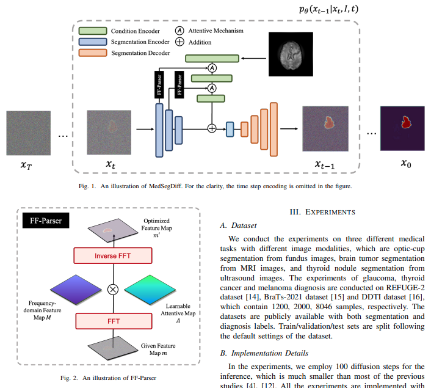

</img>

## MedSegDiff - Pytorch

Implementation of <a href="https://arxiv.org/abs/2211.00611">MedSegDiff</a> in Pytorch - SOTA medical segmentation out of Baidu using DDPM and enhanced conditioning on the feature level, with filtering of features in fourier space.

## Install

```bash
$ pip install med-seg-diff-pytorch
```

## Usage

```python
import torch
from med_seg_diff_pytorch import Unet, MedSegDiff

model = Unet(
    dim = 64,
    image_size = 128,
    dim_mults = (1, 2, 4, 8)
)

diffusion = MedSegDiff(
    model,
    timesteps = 1000
).cuda()

segmented_imgs = torch.rand(8, 3, 128, 128)  # inputs are normalized from 0 to 1
input_imgs = torch.rand(8, 3, 128, 128)

loss = diffusion(segmented_imgs, input_imgs)
loss.backward()

# after a lot of training

pred = diffusion.sample(input_imgs)     # pass in your unsegmented images
pred.shape                              # predicted segmented images - (8, 3, 128, 128)
```

## Appreciation

- <a href="https://stability.ai/">StabilityAI</a> for the generous sponsorship, as well as my other sponsors out there

## Todo

- [ ] some basic training code, with Trainer taking in custom dataset tailored for medical image formats

## Citations

```bibtex
@article{Wu2022MedSegDiffMI,
    title   = {MedSegDiff: Medical Image Segmentation with Diffusion Probabilistic Model},
    author  = {Junde Wu and Huihui Fang and Yu Zhang and Yehui Yang and Yanwu Xu},
    journal = {ArXiv},
    year    = {2022},
    volume  = {abs/2211.00611}
}
```
